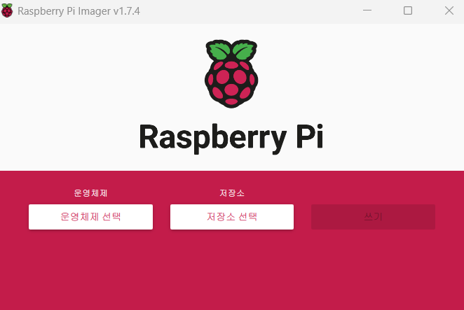

# 캡스톤 디자인 
## "안면실인증 환자를 위한 스마트 글래스" 제작"

---
## Chapter 2
## RaspberryPi Zero 2W OS설치 및 환경 세팅

### 1. 라즈비안 OS 설치 
Raspberry Pi Imager를 설치 -> 운영체제를 쉽게 sd카드에 넣을 수 있음.

1. 운영체제를 선택한다. -> RaspberryPi OS(other)에 가서 64bit 운영체제를 선택<br>
2. 저장소를 선택한다. -> 구매한 SD카드를 SD카드 리더기에 넣고, SD카드 드라이브를 선택<br>
3. 톱니바퀴 버튼을 클릭한다. -> (없을 시 그냥 진행해도됨.)<br>
3-1.SSH 사용(비밀번호 인증 사용), 사용자 이름 및 비밀번호 설정(원하는대로 설정) <br>
3-2.무선 LAN설정(현재 컴퓨터에 사용되고 있는 Wifi가 선택됨.) 무선LAN국가:KR <br>
3-3. 로케일 설정 지정(Asia/Seoul , 키보드 레이아웃 kr) 체크 후 저장
4. 쓰기를 누르고 완료 될때까지 기다리기 (5분 정도 걸림)

### 2. 라즈베리파이 한글 설정
**1. 먼저 라즈베리파이 OS 시스템 업그레이드 부터 시행**
```bazaar
터미널을 열고
sudo apt update - 시스템의 패키지 목록을 업데이트함.
sudo apt full-upgrade - 설치된 패키지들을 최신으로 업그레이드 함.
sudo reboot - 재부팅
```
**업데이트 오류**<br>
Error - Could not get lock var/lib/pat/lists/lock -open(11: Resource temporarily unavailable)
**오류 해결** <br>
```bazaar
sudo rm /var/lib/apt/lists/lock 
sudo rm /var/cache/apt/archives/lock
sudo rm /var/lib/dpkg/lock
패키지 업데이트를 막는 lock 파일들을 삭제
```
**2. 라즈베리파이 Configuration 설정**<br>
왼쪽 상단 라즈베리파이 아이콘을 클릭 후 RaspberryPi Configuration에 들어가 Localisation 선택
```bazaar
Locale      - Language : ko
              Country: KR
              Character Set: UTF-8
TimeZone    - Area: Asia
              Location: Seoul
KeyBoard    - Model: Generic 105-key PC(intl.)
              Layout: Korean
              Variant: Korean
Wireless    - Country: KR Korea (South) 
```
**3.라즈베리파이 한글 설치**<br>
```bazaar
터미널을 열고
sudo apt ibus ibus-hangul # 한글 입력기 설치
sudo apt install fonts-nanum fonts-unfonts-core # 한글 폰트 설치
```

이러면 기본 세팅은 끝!
